# Library Management System (LMS)

An android application built for managing a library's catalog of authors and books. This system features a relational database with full CRUD capabilities, strict data validation, and a modern Material Design interface.

## 📱 Features

- **Book Management**: Full lifecycle management for books including unique ISBN tracking.
- **Author Management**: Author registration with automated book-cleanup (Cascade Delete).
- **Theming**: Comprehensive support for **Light and Dark Mode** based on system settings.
- **Visual Feedback**: Real-time validation for forms and secure confirmation dialogs for destructive actions.

## 🛠 Tech Stack

- **Language**: Kotlin
- **Database**: SQLite 
- **UI Components**: RecyclerView, Material 3, Fragments, Floating Action Buttons (FAB).

## 📸 Project Showcase

### User Interface
| Launching Screen | Books List | Authors List |
|:---:|:---:|:---:|
| 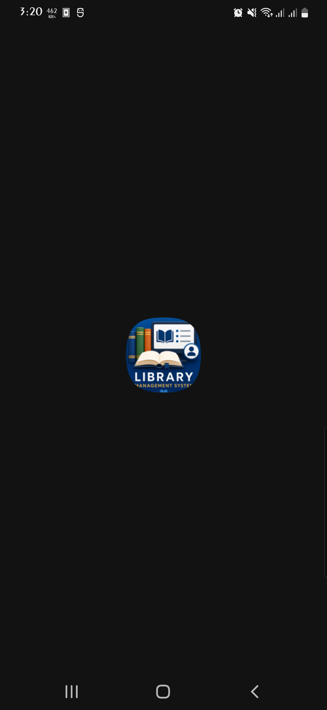 | 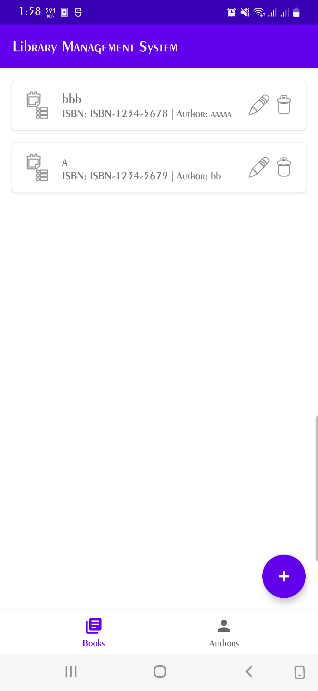 | 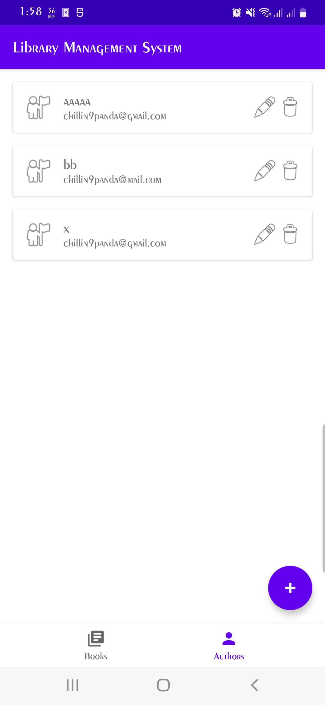 |

### Forms & Editing
| Add Book | Edit Book | Add Author | Edit Author |
|:---:|:---:|:---:|:---:|
| 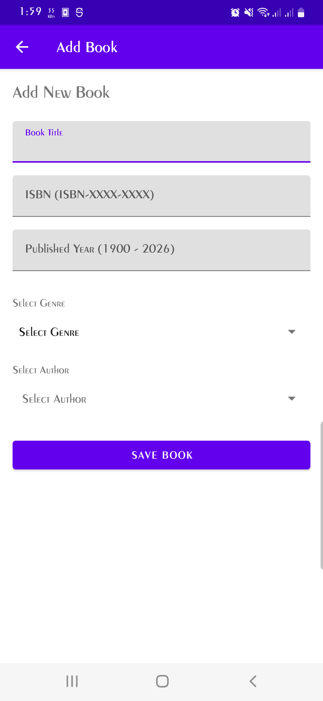 | 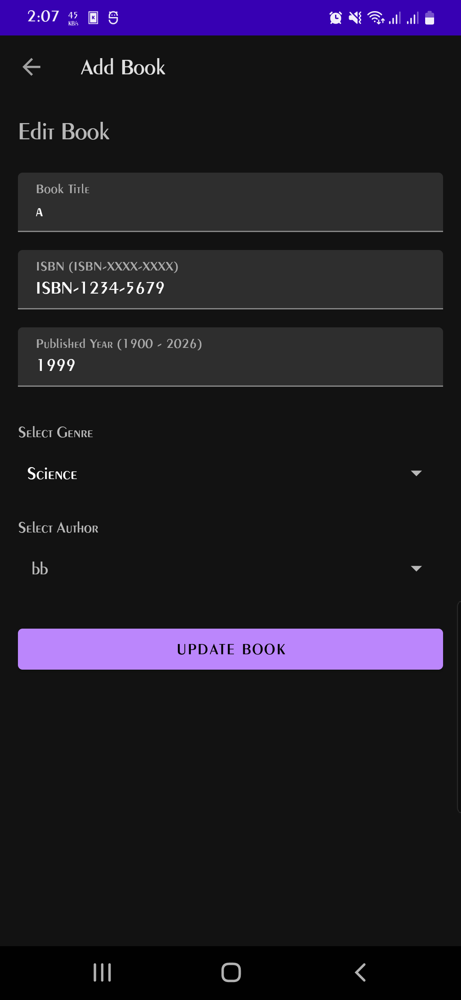 | 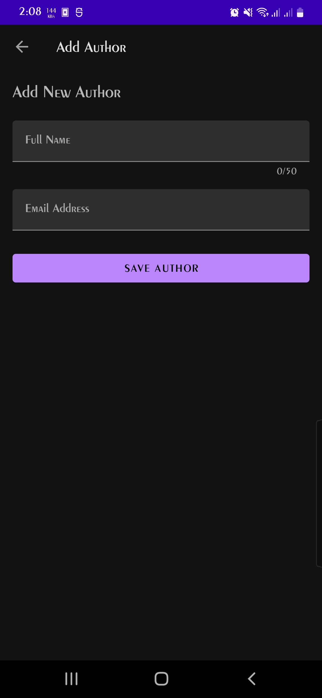 | 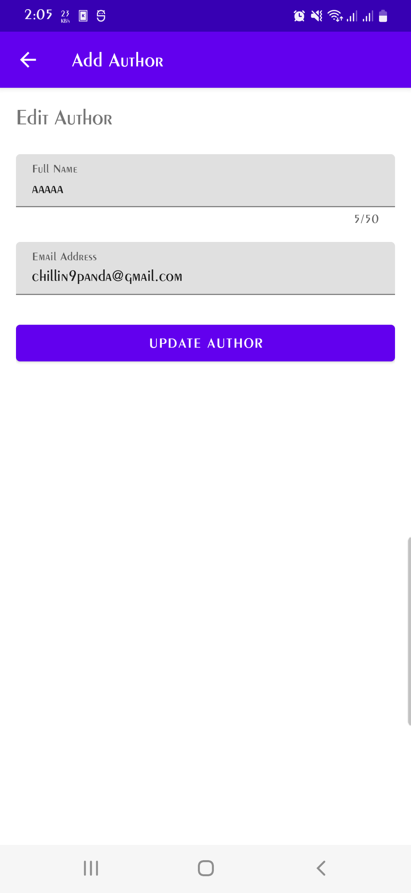 |

### 🛡 Validation & Logic (Requirements Proof)
| ISBN Format & Uniqueness | Publish Year Range | Author Name/Email |
|:---:|:---:|:---:|
| 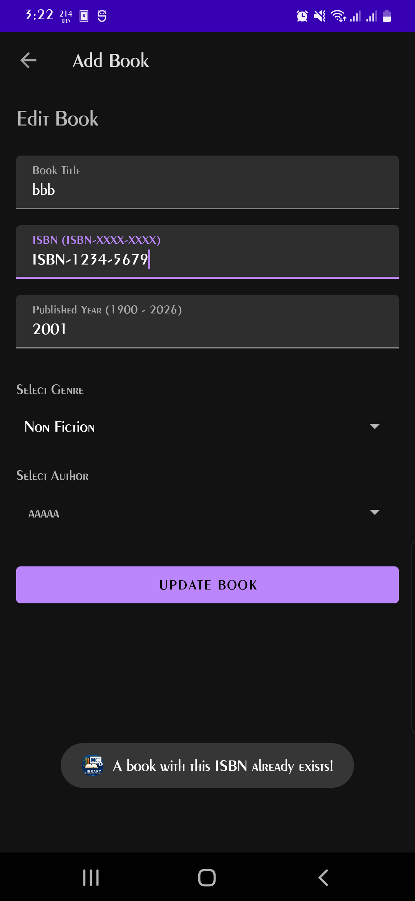 | 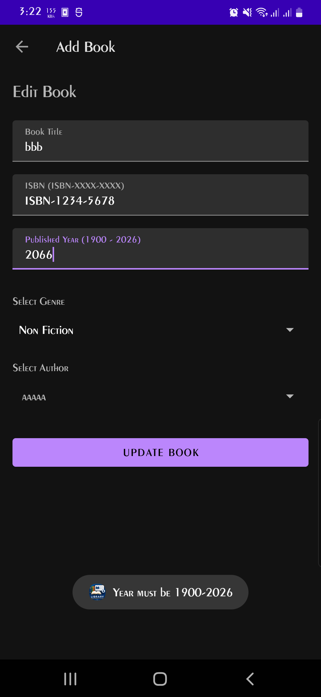 | 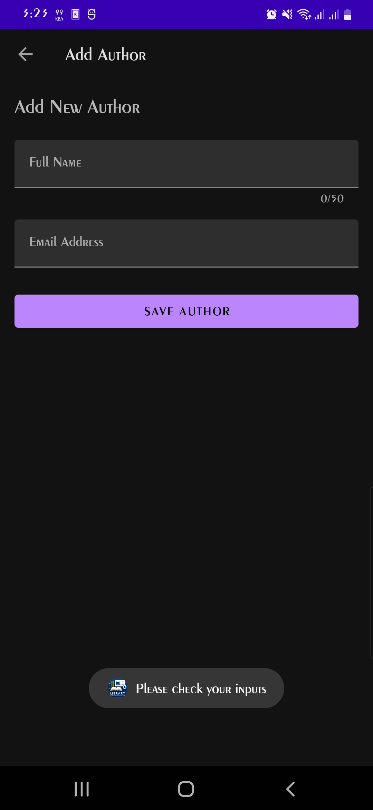 |

### 🗄 Database & Constraints
| Database Schema & Inspection | Delete Author (Cascade) | Delete Book |
|:---:|:---:|:---:|
| 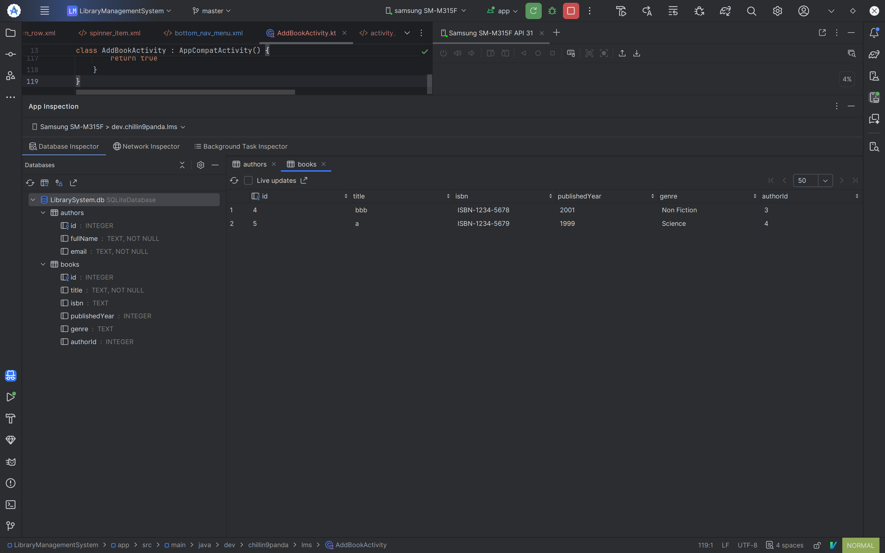 |  | 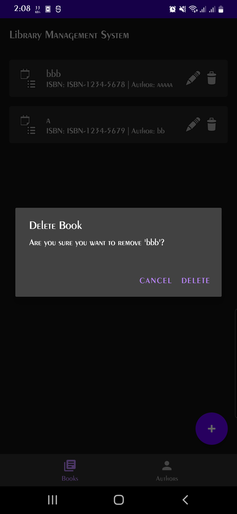 |

## 📋 Technical Requirements

### 1. Database Integrity
- **Relational Mapping**: Books are linked to Authors via `authorId`.
- **Cascade Delete**: Deleting an author automatically invokes a trigger to delete all books associated with that author.
- **Uniqueness**: The database enforces a `UNIQUE` constraint on the ISBN column.
- **Verification**: Database structure verified via Android Studio Database Inspector.

### 2. Business Logic & Validation
- **ISBN**: Must match the pattern `ISBN-XXXX-XXXX`.
- **Publication Year**: Restricted to a valid range between `1900` and `2026`.
- **Author Constraints**: Name length is capped at 50 characters to maintain data hygiene.
- **Author Email**: need to contain valid email indicator
- **Valid Form**: Form needs to be filled to submit

## How to Run
1. Open in Android Studio Ladybug(Android 5.0)+ in Files > Open Project.
2. Sync Dependecies
3. Build and Run on an emulator/physical Device 
4. Toggle System Dark Mode to see the UI adapt.

---
*Developed for the Android Application Development Assignment.*
